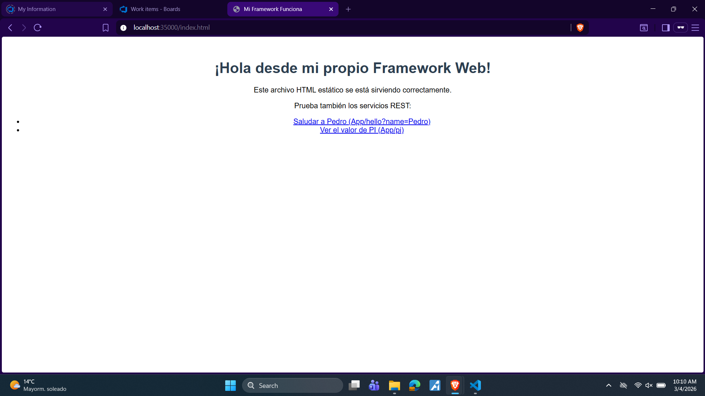
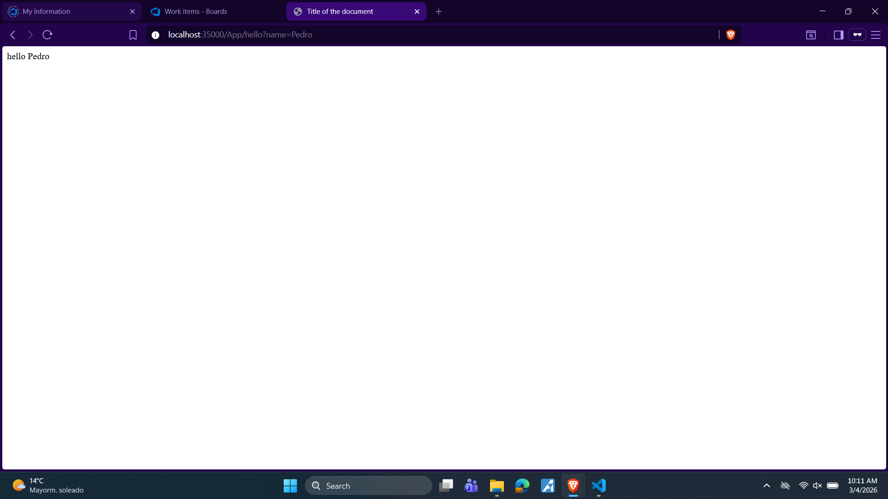
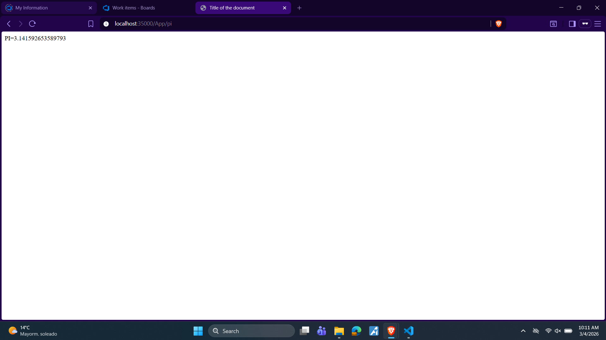
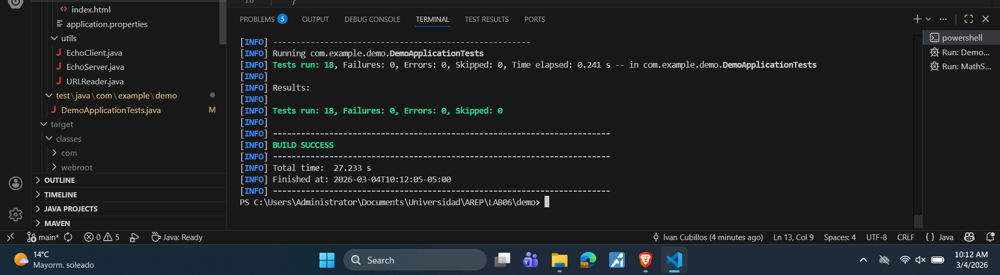

# AREP MicroFrameworks — Framework Web para Servicios REST

Framework web liviano desarrollado en Java que permite construir aplicaciones con servicios REST y servir archivos estáticos, sin depender de frameworks externos como Spring MVC. Implementado sobre sockets TCP puros.

## Tabla de contenidos

- [Descripción](#descripción)
- [Arquitectura](#arquitectura)
- [Requisitos](#requisitos)
- [Instalación y ejecución](#instalación-y-ejecución)
- [Uso del framework](#uso-del-framework)
- [Ejemplo de aplicación](#ejemplo-de-aplicación)
- [Pruebas](#pruebas)

---

## Descripción

El proyecto convierte un servidor HTTP básico en un micro-framework funcional que ofrece tres capacidades principales:

- Registro de servicios REST mediante expresiones lambda con `get()`
- Extracción de parámetros de consulta desde la URL con `req.getValue()`
- Configuración del directorio de archivos estáticos con `staticfiles()`

---

## Arquitectura

```
src/main/java/com/example/demo/
├── HttpServer.java        # Núcleo del framework: manejo de sockets, routing y archivos estáticos
├── HttpRequest.java       # Parseo de query parameters de la URL
├── HttpResponse.java      # Objeto de respuesta (extensible)
├── WebMethod.java         # Interfaz funcional para lambdas REST
└── appexamples/
    └── MathServices.java  # Ejemplo de aplicación construida sobre el framework
```

### Flujo de una petición

```
Cliente (browser)
      │
      ▼
HttpServer (puerto 35000)
      │
      ├── ¿Existe endpoint registrado para la ruta?
      │         │ Sí → ejecuta lambda → responde HTML
      │         │
      │         └── No → busca archivo en staticFilesPath → responde archivo o 404
```

### Componentes clave

**`HttpServer`** es el núcleo. Escucha en el puerto 35000, parsea la línea HTTP de entrada, extrae la ruta y el query string, y decide si despachar a un endpoint REST o servir un archivo estático. Los endpoints se almacenan en un `HashMap<String, WebMethod>`.

**`WebMethod`** es una interfaz funcional con un único método `execute(HttpRequest, HttpResponse)`, lo que permite registrar rutas usando expresiones lambda directamente.

**`HttpRequest`** recibe el query string de la URL y lo parsea en un mapa clave-valor accesible mediante `getValue(String key)`.

**`MathServices`** es la aplicación de ejemplo. Configura el directorio de archivos estáticos, registra los endpoints `/App/hello` y `/App/pi`, y delega la ejecución al servidor.

---

## Requisitos

- Java 17 o superior
- Maven 3.8 o superior
- Git

---

## Instalación y ejecución

### 1. Clonar el repositorio

```bash
git clone https://github.com/IvanCamiloCubillos13/AREP_MicroFrameworks.git
cd AREP_MicroFrameworks
```

### 2. Compilar el proyecto

```bash
mvn clean package
```

### 3. Ejecutar la aplicación

```bash
mvn exec:java -Dexec.mainClass="com.example.demo.appexamples.MathServices"
```

O desde el IDE ejecutando directamente la clase `MathServices`.

### 4. Acceder desde el browser

| Recurso | URL |
|---|---|
| Página estática | `http://localhost:35000/index.html` |
| Saludo con parámetro | `http://localhost:35000/App/hello?name=Pedro` |
| Valor de PI | `http://localhost:35000/App/pi` |

---

## Uso del framework

Un desarrollador puede construir su propia aplicación sobre el framework de la siguiente manera:

```java
import static com.example.demo.HttpServer.get;
import static com.example.demo.HttpServer.staticfiles;
import com.example.demo.HttpServer;

public class MiAplicacion {
    public static void main(String[] args) throws Exception {

        staticfiles("/webroot");

        get("/App/hello", (req, res) -> "Hello " + req.getValue("name"));
        get("/App/pi",    (req, res) -> "PI=" + Math.PI);

        HttpServer.main(args);
    }
}
```

### Métodos disponibles

**`staticfiles(String path)`**
Define el directorio base para archivos estáticos. El servidor los buscará bajo `target/classes` + el path indicado.

```java
staticfiles("/webroot");
```

**`get(String path, WebMethod lambda)`**
Registra un endpoint GET asociado a una expresión lambda.

```java
get("/saludo", (req, res) -> "Hola mundo");
```

**`req.getValue(String key)`**
Extrae un parámetro de la query string de la URL.

```java
req.getValue("name"); 
```

---

## Ejemplo de aplicación

`MathServices.java` demuestra cómo usar el framework con dos servicios REST y un archivo estático:

```java
staticfiles("/webroot");
get("/App/pi",    (req, res) -> "PI=" + Math.PI);
get("/App/hello", (req, res) -> "hello " + req.getValue("name"));
HttpServer.main(args);
```

---

## Pruebas

### Pruebas funcionales (browser)

**Archivo estático — `http://localhost:35000/index.html`**



**Endpoint `/App/hello?name=Pedro` — `http://localhost:35000/App/hello?name=Pedro`**



**Endpoint `/App/pi` — `http://localhost:35000/App/pi`**



### Pruebas unitarias automatizadas

El proyecto incluye 18 pruebas unitarias en `DemoApplicationTests.java` que cubren:

- Parseo de query parameters simples y múltiples
- Manejo de parámetros ausentes, null y vacíos
- Registro y ejecución de endpoints con lambdas
- Uso de parámetros dentro de lambdas
- Registro de múltiples endpoints y sobreescritura
- Configuración de `staticfiles()`
- Implementación de la interfaz `WebMethod`

Para ejecutar las pruebas:

```bash
mvn test
```

**Resultado — 18 pruebas, 0 fallos, 0 errores:**



---

Autor: Ivan Cubillos
